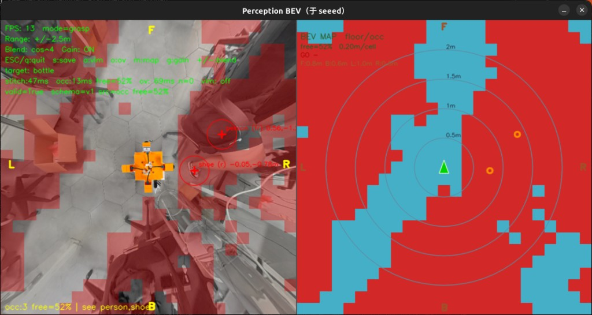

# Perception：视觉分析与相对定位

本 demo 放在**带机械臂的底盘**上：四路鱼眼 GPU BEV 提供 360° 俯视；**YOLO-World** 粗定位待抓取目标的 `base_link` `(x_m, y_m)`，给臂做环视辅助；占用栅格提供避障与路线规划参考。本阶段**不发**底盘 / 臂控制指令。只改 `perception/` / 启动脚本；**不碰标定源码**。



占用栅格：把已是米制的 BEV 切成格子（默认 0.2 m）。对脚/鞋等小物体用「格子内障碍占比」+ 颜色差，并把 YOLO 框也盖进栅格（右边站人时格子会跟上）。`--occ-thresh` 越低越敏感。  
YOLO-World：开放词汇（鼠标/瓶/杯/手机/键盘等），`--target` 只决定哪个算夹取目标，其它物体仍画在 BEV 上。框心 → `base_link` `(x_m, y_m)`。imgsz=384、约 0.8s 一轮。加载权重时走 CPU 拼接（视频不停），加载完恢复 CUDA。

## 快速运行

```bash
cd ~/bev_demo/avm_gpu
./scripts/download_perception_models.sh   # 首次

./scripts/run_perception.sh --vlm off --mode nav --range 2.5
./scripts/run_perception.sh --mode grasp --target bottle
./scripts/run_perception.sh --mode nav --ov --vlm off
./scripts/run_perception.sh --mode nav --range 2.5 --vlm qwen3vl-2b
./scripts/run_perception.sh --no-window
/usr/bin/python3 -m perception.smoke_offline
```

输出：`output/perception/preview.jpg`、`events.jsonl`。  
键盘：`ESC/q` 退出 · `o` YOLO-World 立刻跑一轮 · `a` VLM · `s` 存帧。  
车体：`python3 scripts/make_ego_overlay.py 俯拍.jpg -o assets/ego_overlay.png`。默认自动铺满画面中心拼接黑区；要固定米制尺寸再加 `--ego-size-m 0.18`。  
红半透明格 = occupied；青十字 = 夹取目标；红十字 = 其它 YOLO 物体。  
右侧 **2D OCC** 是同一套栅格的俯视图（上=前）：红=障碍、绿三角=车、圈=距离；`m` 开关，`--no-occ-map` 关闭。

## 坐标系（锁死）

| 量 | 约定 |
|----|------|
| 图像 | `u` 右、`v` 下；画面**上=车前** |
| `base_link` | 原点 ≈ BEV 画布中心；**+X 前、+Y 左** |
| 尺度 | `s = scale_px_per_meter`（运行时 `--scale`，与标定一致时可对照 `calib_results/extrinsics.json`） |
| 变换 | `x_m = (cy - v) / s`，`y_m = (cx - u) / s` |
| `frame_id` | 恒为 `"base_link"` |
| 消息版本 | `schema_version: 1` |

占用栅格仍把中心约 `blind_frac=0.12` 当车体盲区；YOLO 夹取框即使靠近车体也会填 `x_m/y_m`。

限制：IPM 地面平面近似；无深度 → 仅 2D 地面位姿；VLM 点位为语义粗定位，非检测器级框。

## 消息契约

**nav**

```json
{
  "schema_version": 1,
  "frame_id": "base_link",
  "stamp_s": 1710000000.0,
  "mode": "nav",
  "valid": true,
  "infer_ms": 800,
  "summary": "…",
  "nav": {
    "obstacles": [
      {"label": "carton", "azimuth": "fl", "u_norm": 0.35, "v_norm": 0.28,
       "conf": 0.7, "x_m": 1.1, "y_m": 0.75, "radius_m": 0.25}
    ],
    "free_dirs": ["right"],
    "uncertain": []
  }
}
```

**grasp**（底盘转向粗对准，不是 6DoF 抓取）

```json
{
  "mode": "grasp",
  "valid": true,
  "summary": "右转25° · 1.1m · 约1点 · 右前有瓶子",
  "grasp": {
    "turn_hint": "右转25° · 1.1m · 约1点",
    "targets": [
      {"label": "bottle", "azimuth": "fr", "u_norm": 0.72, "v_norm": 0.35,
       "conf": 0.8, "graspable": true, "x_m": 0.6, "y_m": -0.88,
       "yaw_deg": -55.7, "range_m": 1.06}
    ],
    "best_target_id": 0,
    "notes": "右前有瓶子"
  }
}
```

`yaw_deg`：`base_link` 朝向目标，0=前、正=左转、负=右转。由 `u_norm/v_norm` 几何算出，不信 VLM 自己报的角度。无像素时退化为 azimuth 粗方位（±45° 一档）。

解析失败：`valid=false`，`error` 说明原因，`summary` 保留原文截断；拼接不停。

进程内总线：`perception.bus.PerceptionBus`（`publish` / `latest` / `subscribe`）。日后可换成 ROS2 publisher，字段一一映射即可。

## 模块

| 路径 | 作用 |
|------|------|
| `perception/occupancy.py` | BEV → 占用栅格（默认导航几何） |
| `perception/schema.py` | JSON schema + prompt + 解析降级 |
| `perception/localize.py` | 像素/归一化 → 米制 |
| `perception/vlm_worker.py` | 子进程：直连 transformers Qwen3-VL（`ANALYZE`） |
| `perception/vlm_client.py` | 父进程异步客户端 |
| `perception/viz.py` / `run.py` | Overlay + 主循环 |
| `scripts/run_perception.sh` | 环境一键启动 |

VLM 协议：`ANALYZE <jpg> nav` 或 `ANALYZE <jpg> grasp <target>` → `OK <ms>` + 一行 JSON + `END`。

权重默认读 `PERCEPTION_MODELS`（可落到 `~/leucus/models/worldmm/Qwen3-VL-*-Instruct`，仅复用目录，不依赖 WorldMM 代码）。解释器用 `PERCEPTION_VENV_PYTHON`（默认同 leucus torch venv）。

## 与未来底盘 / 臂的接口草图

```text
PerceptionBus (schema v1)
    ├── NavResult.obstacles / free_dirs     →  局部代价 / 通行提示（日后 cmd_vel）
    └── GraspResult.turn_hint / yaw_deg     →  底盘原地转到目标方位，再接近 range_m
        GraspResult.targets[x_m,y_m]        →  地面粗点；臂 6DoF 仍需腕部相机
```

本阶段不发控制指令。

## Orin → Thor 检查表

- [ ] JetPack / CUDA 版本与侧装 CUDA OpenCV 路径（`scripts/env_opencv_cuda.sh`）
- [ ] GMSL / V4L2 节点与 `config/camera_profile.json` 索引
- [ ] `PERCEPTION_VENV_PYTHON`（torch/transformers）与 `PERCEPTION_MODELS` 权重
- [ ] `PERCEPTION_DEVICE_MAP` / `PERCEPTION_DTYPE`（bf16 是否可用）
- [ ] 标定产物：`calib_results/{front,back,left,right,extrinsics}.json`
- [ ] 跑通 `perception.smoke_offline` + `./scripts/run_perception.sh --vlm off`
- [ ] 再开 VLM：`--mode nav` / `--mode grasp`；看 HUD/`events.jsonl` 的 `infer_ms`
- [ ] 消息仍为 `schema_version: 1`（若改字段则升版本）
- [ ] （后续）Thor 或 x86 NVIDIA 机：TensorRT Edge-LLM INT4 导出 → Orin/Thor 本机构建 engine

感知逻辑不绑 Orin API；硬件差异收口到 env 脚本与相机 profile。当前不做 INT4。
